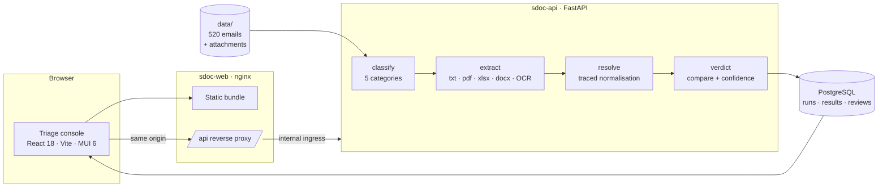

# Emails, Please

Reads a shipping operations inbox, compares each Shipping Instruction against
its draft Bill of Lading, and escalates what it cannot honestly decide.

**[Live demo](https://sdoc-web.bluegrass-42d42f8e.southeastasia.azurecontainerapps.io)**
 · **[Demo video](https://drive.google.com/file/d/1on-DhmtKGpbvGaiBRxXxTtypJLOTd4xF/view?usp=sharing)**

---

520 mixed messages arrive. Each is classified, and document-check requests are
compared across seven fields. The interesting half is what happens when the
answer is not obvious: every value carries a trace of how it was read,
interpretive steps cost confidence, and anything below the bar goes to a human
in a console that shows its working. Output is a scored `submission.json` and
a triage queue an operator could actually use.

## Features

- **Confidence is derived, not asserted.** Trim and case are free; dropping a
  UN/LOCODE or converting units each carry a published penalty and a reason.
- **Every comparison shows its working.** Each field expands into the journey
  from page text to compared value, per document.
- **The reviewer states an outcome, not an opinion.** Clear, Discrepancy, or
  Second look. Whether that agreed with the machine is derived server-side.
- **Two safeguards on release.** Clearing a flagged shipment is press-and-hold
  and stays locked until every flagged field has been opened.
- **Keyboard-first.** `J`/`K` move, `N` jumps to the next flagged field,
  `C`/`D`/`E` decide, `U` undoes. Lowest confidence first.
- **Append-only audit trail.** Who decided what, when, why, and how long it
  took. Undo removes only the standing entry.
- **Decisions survive re-runs.** Carried forward, and flagged **recheck** if
  re-extraction changed the machine's verdict.
- **Local OCR.** Scans are read with ONNX models offline, no API key. A page
  that will not read degrades one email, never the run.
- **Reset demo.** The demo has no login, so any judge can clear all decisions
  and re-run from a confirm dialog.

Why each tuning constant and judgment call is what it is: **[DECISIONS.md](DECISIONS.md)**.

## Architecture



The API has **internal ingress only**. The browser sees one origin and nginx
proxies `/api`, so no CORS grant is needed and the API is not publicly
reachable.

| Layer | |
|---|---|
| Backend | Python 3.12 · FastAPI · SQLAlchemy 2.0 · Pydantic Settings |
| Database | PostgreSQL, SQLite fallback |
| Frontend | React 18 · Vite · MUI 6 |
| OCR / parsing | rapidocr-onnxruntime · pypdf · openpyxl · python-docx |
| Serving | nginx — SPA plus `/api` reverse proxy |
| Infrastructure | Docker · Azure Container Apps · Azure Container Registry |
| Tests | pytest — 146 |

## Quick start

**1. Get the dataset**

It is **not in this repository** — it belongs to the hackathon organisers.
Nothing runs without it, so this is step one. Unpack the participant bundle
into `data/` at the project root:

```
data/
├── inbox/                  520 email .json records
├── attachments/            the SI and BL documents
├── loader.py
└── sample_submission.json
```

```bash
ls data/inbox | wc -l        # expect 520
```

`data/` is gitignored, so a local copy is never committed. Note that
`backend/Dockerfile` does `COPY data /data` — Container Apps cannot
bind-mount a host folder — so **the image build needs `data/` present**.

**2. Start everything**

```bash
docker compose up --build
```

**3. Open the console**

```
http://localhost:5173
```

The first run starts automatically and takes about ten seconds: 500 emails in
~1.5s, then the 20 OCR-heavy scanned cases.

| Service | Port |
|---|---|
| web (nginx + SPA) | 5173 |
| api (FastAPI) | 8000 |
| db (PostgreSQL) | 5432 |

<details>
<summary>Without Docker, or headless</summary>

```bash
cd backend && pip install -r requirements.txt && uvicorn app.main:app --reload
```

```bash
cd frontend && npm install && npm run dev
```

Headless — no services, writes the scored artefact:

```bash
cd backend && python -m app.pipeline.run ../data -o submission.json
```

</details>

## Tests

```bash
cd backend && python -m pytest tests -q
```

146 tests: pipeline end to end, comparison and confidence bands,
classification, the review model, run lifecycle and failure states, and the
demo reset. The OCR tests need a few hundred MB free — `bad allocation` means
the host is out of memory, not a broken build.

CI runs the 32 dataset-independent tests; the full 146 run locally once the
dataset is in place.

## Deployment

Azure Container Apps, via `deploy/azure.ps1` or `deploy/azure.sh` — full
instructions and environment variables in **[docs/DEPLOYMENT.md](docs/DEPLOYMENT.md)**.
